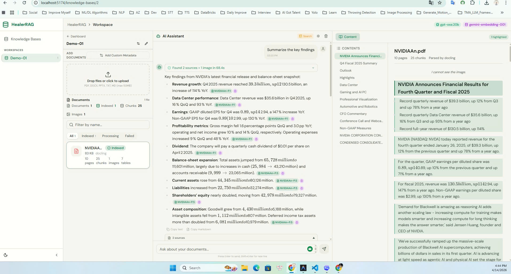
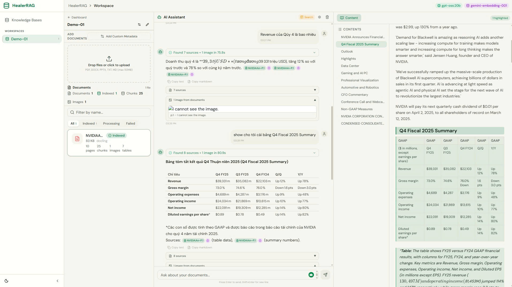
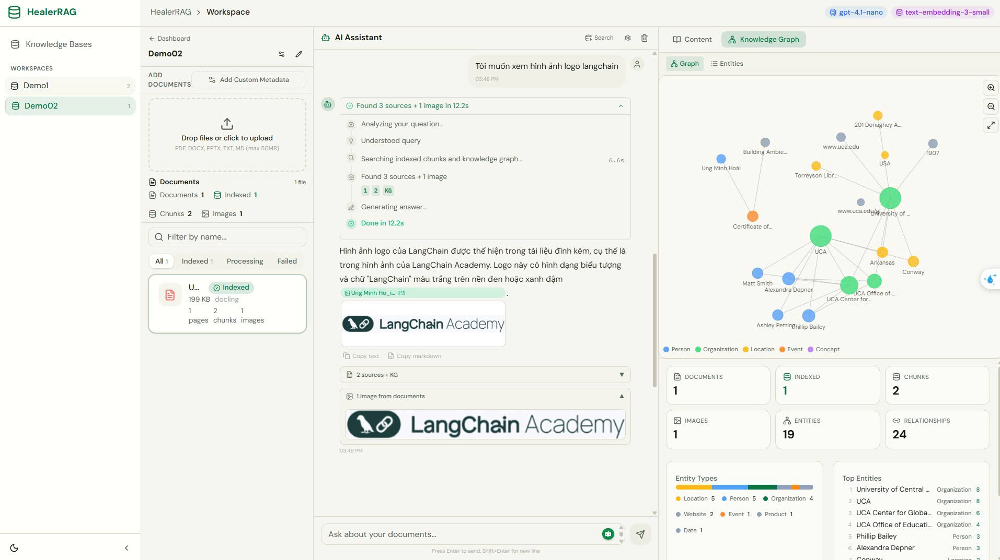
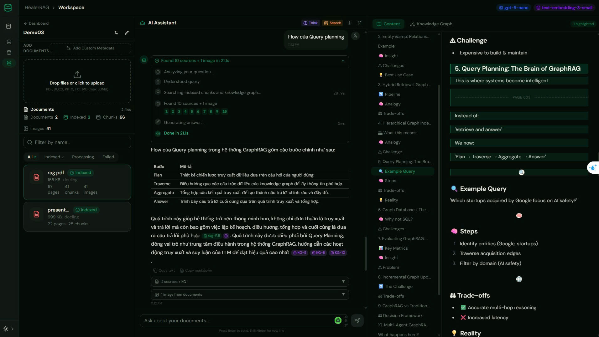
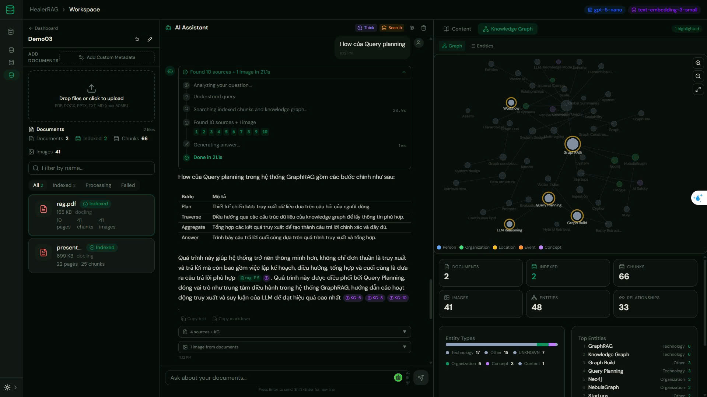
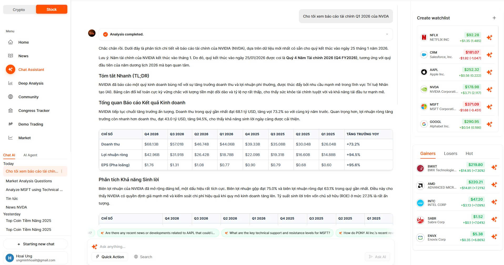
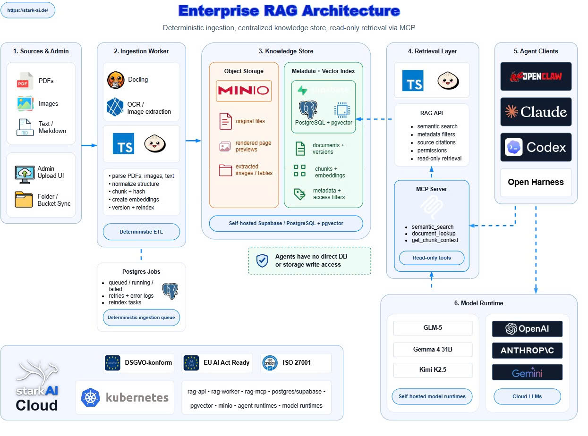

# Document Ingestion & RAG Platform (The same NotebookLM)

Nền tảng xử lý tài liệu và truy vấn tri thức theo mô hình RAG, tập trung vào bài toán ingest tài liệu cho doanh nghiệp: upload file, parse nhiều định dạng, chuẩn hóa thành markdown/html/assets, chunking, embedding, indexing và chat hỏi đáp trên dữ liệu đã ingest.

## Show case

Dưới đây là một gallery minh họa mà tôi đã test:

**Other project: Financial Assistant**

## Target Architecture 

## Điểm nổi bật
- Hỗ trợ pipeline end-to-end: **upload -> parse -> artifact storage -> chunk -> embedding -> vector index -> retrieval/chat**
- Tích hợp nhiều document parser như **Docling, Marker, MinerU, PaddleOCR, MarkItDown, Chandra**
- **Hybrid retrieval** kết hợp vector search + lexical search, có thể rerank và trả lời kèm **citation / image evidence**
- Hỗ trợ **workspace-based knowledge base**, **ACL/phân quyền tài liệu**, **document versioning**, job tracking và analytics
- Kiến trúc tách lớp rõ ràng: **FastAPI API + worker + parser services riêng + MinIO + PostgreSQL + Chroma/Qdrant + optional Knowledge Graph**

## Kiến trúc
- **Backend ingestion-focused** với API điều phối job và worker xử lý bất đồng bộ
- **Parser services tách riêng** để scale độc lập theo loại tài liệu hoặc GPU workload
- **Object storage** lưu file gốc và parsed artifacts, giúp dễ debug và re-index
- **Kubernetes-ready deployment** theo mô hình separated services, phù hợp production

## Use cases có thể giải quyết
- Xây dựng **kho tri thức nội bộ** từ PDF, tài liệu scan, report, SOP, tài liệu nghiệp vụ
- Triển khai **chatbot hỏi đáp trên tài liệu** có dẫn nguồn rõ ràng
- Hỗ trợ **re-ingest / re-index tài liệu** khi thay đổi parser, embedding hoặc chiến lược retrieval
- Phân tách dữ liệu theo **workspace/team**, phù hợp cho môi trường nhiều phòng ban hoặc nhiều tập tài liệu độc lập

**Tech stack:** FastAPI, Python, MinIO, PostgreSQL, Chroma/Qdrant, LightRAG, Docker, Kubernetes, React/TypeScript